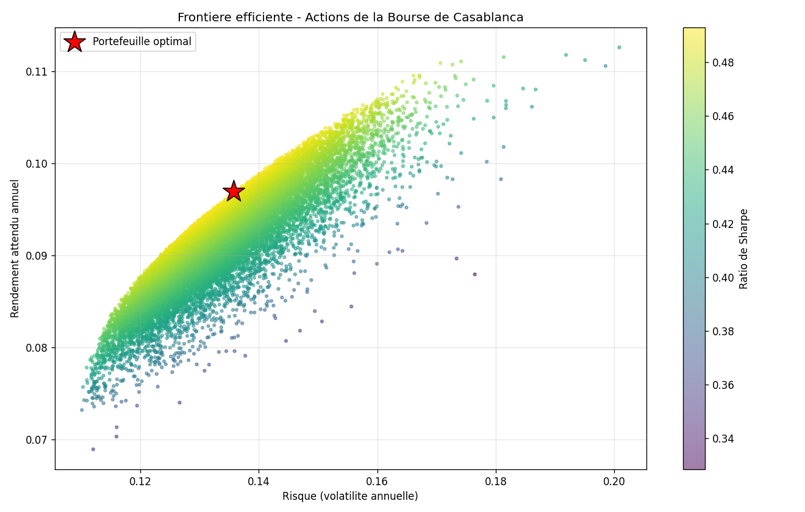

# Optimisation de Portefeuille - Modèle de Markowitz

Un modèle Python qui applique la théorie moderne du portefeuille à un panier d'actions de la Bourse de Casablanca, afin de déterminer la meilleure répartition possible du capital entre plusieurs actions.

## Objectif

La théorie de Markowitz, récompensée par un prix Nobel, repose sur une idée centrale : le risque d'un portefeuille ne dépend pas seulement du risque de chaque action, mais surtout de la manière dont les actions évoluent ensemble. En combinant des actifs peu corrélés, on réduit le risque global sans nécessairement sacrifier le rendement. Ce projet met en pratique cette diversification et identifie le portefeuille offrant le meilleur rapport rendement-risque.

## Ce que fait le modèle

Le programme définit un ensemble d'actions avec leur rendement attendu et leur volatilité, construit la matrice de corrélation qui mesure comment elles bougent ensemble, puis génère des milliers de portefeuilles aux pondérations différentes. Pour chacun, il calcule le rendement, le risque et le ratio de Sharpe. Il trace ensuite la frontière efficiente et met en évidence le portefeuille optimal, celui qui maximise le rendement par unité de risque.

## Les actions retenues

L'analyse porte sur six valeurs de la Bourse de Casablanca : Attijariwafa Bank, Maroc Telecom, LafargeHolcim Maroc, BCP, Cosumar et Marsa Maroc. Leurs rendements attendus et leurs volatilités sont des estimations réalistes servant à illustrer la méthode ; dans un cas réel, ils seraient calculés à partir de l'historique des cours.

## Résultats

Le portefeuille optimal identifié atteint un rendement attendu de 9.7% pour une volatilité de seulement 13.6%, soit un niveau de risque inférieur à celui de la plupart des actions prises isolément. C'est la démonstration concrète de la diversification : en répartissant le capital sur des actions faiblement corrélées, le modèle obtient un meilleur couple rendement-risque que n'importe quelle action seule.



Sur le graphique, chaque point représente un portefeuille possible, coloré selon son ratio de Sharpe. Le bord supérieur gauche du nuage forme la frontière efficiente, et l'étoile rouge marque le portefeuille optimal.

## Concepts appliqués

Couple rendement-risque, volatilité, matrice de corrélation et de covariance, diversification, frontière efficiente, ratio de Sharpe et taux sans risque.

## Technologies

Python 3, avec NumPy pour les calculs matriciels, pandas pour la présentation des données et Matplotlib pour la visualisation.

## Comment lancer

```
pip install numpy pandas matplotlib
python markowitz_portfolio.py
```

Le programme affiche les résultats en console et génère l'image markowitz_frontiere.png.

Projet réalisé dans le cadre de mon parcours en Finance (M1, ENCG Fès).
